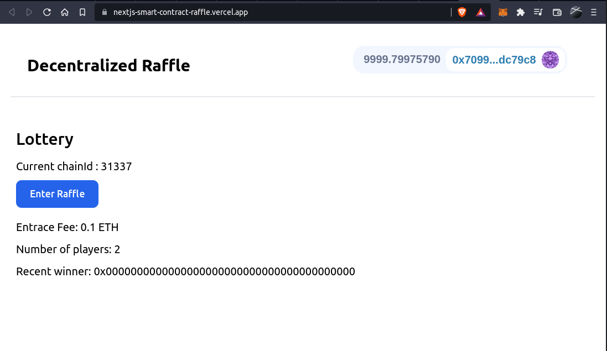

# Smart Contract Raffle

The working app can be viewed [here](https://nextjs-smart-contract-raffle.vercel.app/).

You can enter the raffle using a Rinkeby test net, or if you want you can spin a hardhat node locally and enter the raffle as well.



## My learnings

I did this project while completing Patrick Collin's blockchain tutorial.

This dApp has taught me a ton of things:

1. How to get actual verifiable random numbers. This really helps us to choose a lottery winner without any form of bias

2. How to use chainlink keepers to automate smart contracts.

3. How to write proper testing scripts.

4. How to deploy the smart contract regardless of the network we are on.

5. How to make a user interactable web application and connect it to a smart contract.

---

This is a [Next.js](https://nextjs.org/) project bootstrapped with [`create-next-app`](https://github.com/vercel/next.js/tree/canary/packages/create-next-app). The styling has been done using Tailwind CSS.

### Getting Started

First, run the development server:

```bash
npm run dev
# or
yarn dev
```

Open [http://localhost:3000](http://localhost:3000) with your browser to see the result.

You can start editing the page by modifying `pages/index.js`. The page auto-updates as you edit the file.

[API routes](https://nextjs.org/docs/api-routes/introduction) can be accessed on [http://localhost:3000/api/hello](http://localhost:3000/api/hello). This endpoint can be edited in `pages/api/hello.js`.

The `pages/api` directory is mapped to `/api/*`. Files in this directory are treated as [API routes](https://nextjs.org/docs/api-routes/introduction) instead of React pages.

## Learn More

To learn more about Next.js, take a look at the following resources:

-   [Next.js Documentation](https://nextjs.org/docs) - learn about Next.js features and API.
-   [Learn Next.js](https://nextjs.org/learn) - an interactive Next.js tutorial.

You can check out [the Next.js GitHub repository](https://github.com/vercel/next.js/) - your feedback and contributions are welcome!

## Deploy on Vercel

The easiest way to deploy your Next.js app is to use the [Vercel Platform](https://vercel.com/new?utm_medium=default-template&filter=next.js&utm_source=create-next-app&utm_campaign=create-next-app-readme) from the creators of Next.js.

Check out our [Next.js deployment documentation](https://nextjs.org/docs/deployment) for more details.
